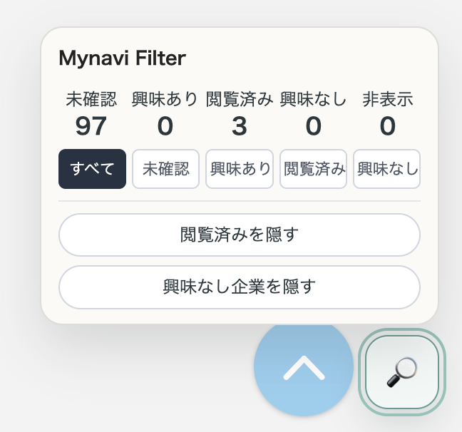
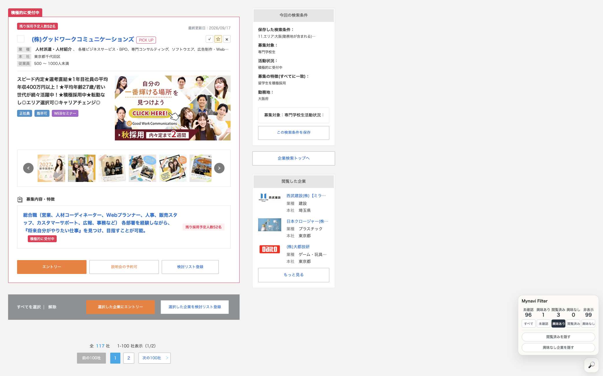
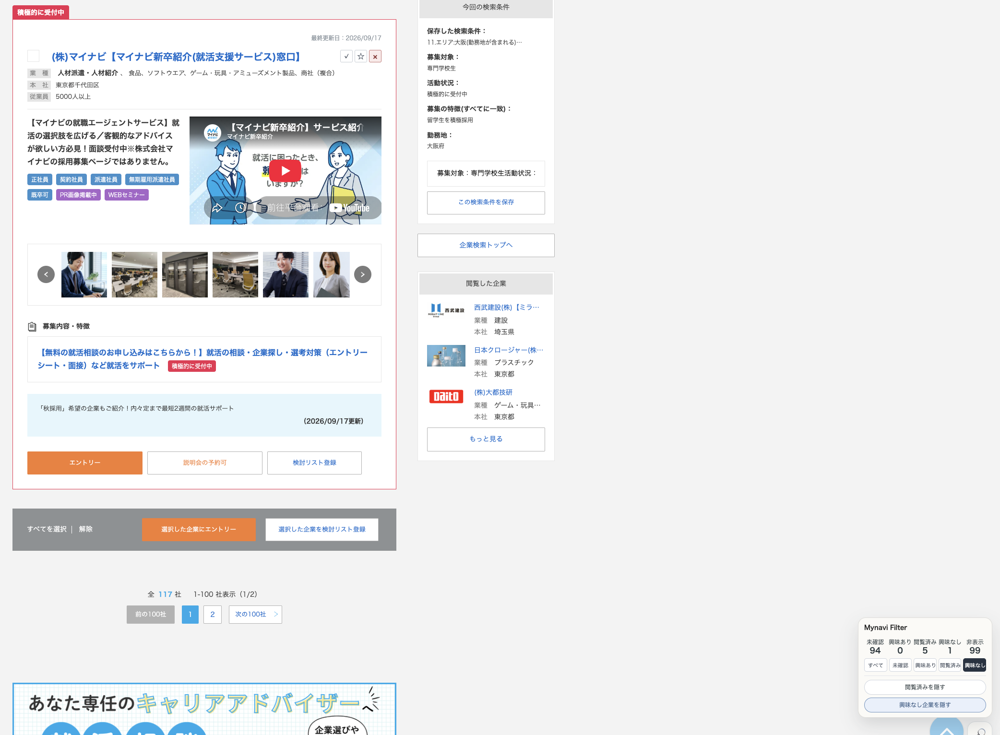

# Mynavi Filter

[日本語](README.md) | **中文** | [English](README.en.md)

**让 Mynavi 的企业搜索更容易整理。**

Mynavi Filter 是一个面向 **マイナビ2027 / 2028 PC 版** 的 Chrome 扩展。它为企业搜索结果增加“已浏览 / 感兴趣 / 不感兴趣”等本地状态，帮助正在日本进行新卒求职的学生，尤其是在日外国学生，更高效地整理大量企业。

在 Mynavi 上连续寻找企业时，很容易遇到这些问题：

- 忘记某家公司以前是否已经看过
- 已经决定不考虑的公司仍反复出现在新的搜索结果中
- 想重新查看候选企业时，很难快速筛出来
- 更换搜索条件后又重复打开同一家企业

Mynavi Filter 不会替代 Mynavi 原有的搜索功能，而是在现有搜索结果上增加一层简单的整理功能。

> 当前为开发版（v0.1），尚未在 Chrome Web Store 发布。

---
## 截图

### 直接整理企业搜索结果

可以给每家企业设置“已浏览 / 感兴趣 / 不感兴趣”。


### 查看和筛选企业状态

通过右下角的 Mynavi Filter，可以快速查看当前搜索结果的状态分布。



### 只看感兴趣的企业

选择“感兴趣”后，只显示你准备继续考虑的企业。



### 隐藏已经排除的企业

可以隐藏已浏览或不感兴趣的企业，把注意力放在还没确认的企业上。



---

## 支持范围

目前支持以下 PC 版 Mynavi 新卒网站：

- Mynavi 2027  
  `https://job.mynavi.jp/27/pc/`
- Mynavi 2028  
  `https://job.mynavi.jp/28/pc/`

插件会从 URL 自动识别年度。

2027 和 2028 的企业状态分别保存。即使同一个企业 ID 同时存在于两个年度，也不会自动跨年度同步状态。

---

## 主要功能

### 1. 用三种状态整理企业

每个搜索结果中的企业都可以设置为：

| 状态 | 含义 |
| --- | --- |
| ✓ 已浏览 | 已经打开企业详情并查看过 |
| ☆ 感兴趣 | 想之后再看、可能会应聘的企业 |
| × 不感兴趣 | 当前已经决定排除的企业 |

真正打开企业详情页后，如果该企业之前还没有人工状态，会自动变为“已浏览”。

如果企业已经被设置为“感兴趣”或“不感兴趣”，再次打开详情页不会把人工状态覆盖成“已浏览”。

---

### 2. 隐藏已浏览或不感兴趣的企业

搜索结果中可以隐藏：

- 已浏览企业
- 不感兴趣企业

隐藏不会删除记录。

之后可以关闭隐藏选项，或者使用“不感兴趣”筛选，再次查看这些企业。

---

### 3. 按状态筛选当前搜索结果

右下角的 Mynavi Filter 浮动菜单可以切换：

- 全部
- 未确认
- 感兴趣
- 已浏览
- 不感兴趣

例如选择“感兴趣”，就可以只查看当前搜索结果中已经保留下来的候选企业。

---

### 4. 查看当前页面统计

浮动菜单会显示当前搜索结果页面内的：

- 未确认
- 感兴趣
- 已浏览
- 不感兴趣
- 已隐藏

这些数字只针对**当前搜索结果页面**，不是整个 Mynavi 网站的企业总数。

---

### 5. 多标签页实时同步

如果从搜索结果中把企业详情页打开到新标签页，搜索结果页会通过 `chrome.storage.onChanged` 接收状态变化。

因此不需要手动刷新，原来的搜索结果页就可以更新：

- 企业状态
- 已浏览数量
- 当前企业的按钮状态
- 隐藏状态

如果从企业详情页使用浏览器“返回”，插件还会通过 `pageshow` 重新读取保存状态，以兼容浏览器的 Back/Forward Cache。

---

## 基本使用方法

1. 在 Mynavi 2027 或 2028 搜索企业。
2. 打开感兴趣企业的详情页。
3. 真正打开过的企业会自动记录为“已浏览”。
4. 在搜索结果中点击 ☆ 可以设为“感兴趣”。
5. 点击 × 可以设为“不感兴趣”。
6. 使用右下角 Mynavi Filter 菜单筛选或隐藏企业。

例如：

```text
搜索结果 100 家
↓
查看 30 家
↓
8 家设为“感兴趣”
↓
22 家设为“不感兴趣”
↓
开启“隐藏不感兴趣企业”
```

之后继续搜索时，就不需要反复确认已经排除的公司。

---

## 安装开发版

目前尚未通过 Chrome Web Store 发布，需要手动加载。

1. 下载或 clone 本仓库。
2. 在 Chrome 打开 `chrome://extensions`。
3. 开启右上角“开发者模式”。
4. 点击“加载已解压的扩展程序”。
5. 选择仓库根目录 `mynavi-filter`。
6. 刷新 Mynavi 2027 / 2028 页面。

本项目没有 npm 依赖，也不需要 build。

---

## 数据与隐私

Mynavi Filter 使用 `chrome.storage.local` 在浏览器本地保存企业整理状态。

当前版本：

- 不向外部服务器上传数据
- 不需要登录
- 没有用户账号
- 没有云同步
- 没有广告 SDK
- 没有第三方统计 SDK

主要保存：

- Mynavi 年度
- 企业 ID
- 企业名称
- 状态（已浏览 / 感兴趣 / 不感兴趣）
- 记录创建时间
- 更新时间
- 最后浏览时间

每个企业使用独立的 storage key，例如：

```text
mynaviFilter:company:27:66450
mynaviFilter:company:28:66450
```

这样可以减少同时打开多个企业页面时，不同企业的数据互相覆盖的风险。

---

## 2027 与 2028 的数据

不同年度的数据独立保存。

例如：

```text
27:66450
28:66450
```

会被视为两条独立记录。

实际调查中，很多企业在 2027 和 2028 使用相同企业 ID，但不能保证所有企业和未来年度都遵循同一规则。

因此当前版本不会自动跨年度同步“感兴趣 / 不感兴趣”等状态。

---

## 当前不会做什么

v0.1 刻意保持简单，目前不包含：

- 自动应聘
- 自动执行 Entry
- 自动填写 ES
- AI 企业评价
- 按年收入、休假天数、勤務地等重新抓取企业
- 大规模自动访问企业详情页
- Recruit / Career-tasu / ONE CAREER 等其他求职网站
- 用户账号
- 云同步
- 收费或订阅

当前目标只有一个：**让 Mynavi 大量搜索结果更容易整理。**

---

## 开发

技术栈：

- Chrome Extension Manifest V3
- Vanilla JavaScript
- CSS
- `chrome.storage.local`
- Node.js `node:test`

没有使用 React / Vue。

运行测试：

```bash
node --test tests/*.test.js
```

JavaScript 语法检查：

```bash
find src tests -name "*.js" -print0 | xargs -0 -n1 node --check
```

页面结构调查：

[`docs/research/mynavi-2027-2028-dom.md`](docs/research/mynavi-2027-2028-dom.md)

---

## 已知限制

Mynavi 没有为本扩展提供官方 DOM API。

如果 Mynavi 修改：

- HTML 结构
- class 名
- URL 结构
- 企业卡片结构

部分功能可能需要同步调整。

目前实现基于实际的 Mynavi 2027 / 2028 PC 页面进行验证。

---

## 反馈

这个项目来自实际新卒求职过程中“搜索结果难以整理”的问题。

尤其欢迎这些用户提供反馈：

- 在日本参加新卒求职的学生
- 在日外国留学生
- 需要同时比较大量企业的求职者

如果发现 bug 或有改进建议，请通过 GitHub Issues 提交。

---

## 免责声明

Mynavi Filter 是个人开发的非官方工具，与株式会社マイナビ及其官方服务没有隶属或合作关系。

“Mynavi / マイナビ”等名称和商标归各自权利人所有。
